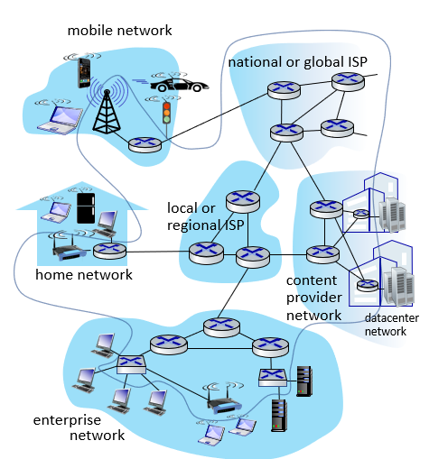
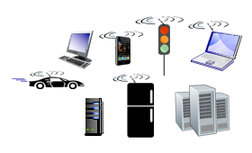
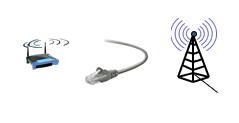
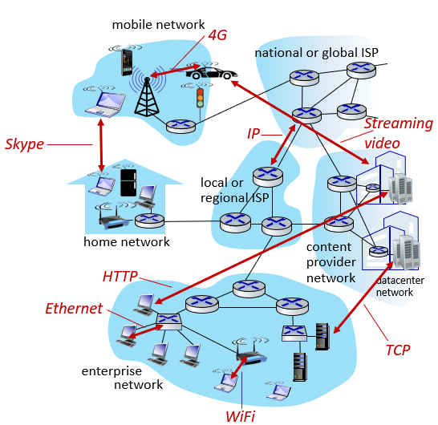

## ch1. Introduction: What is the Internet? What is a protocoal?

# The Internet: a "nuts and bolts" view

nuts and bolts view: 하드웨어와 소프트웨어의 구성으로 보는 관점

위 그림의 가느다란 선(경계선) 기준으로 바깥이 edge, 안이 core

Billions of connected computing **devices:** 

- **hosts = end systems**
- running network apps at Internet's "edge": 인터넷에 접속시키는 프로그램을 실행시킬 수 있는 장치 (컴퓨터, 폰 ...)

**Packet switche:** forward packets (chuncks of data); 패킷(데이터 전송단위)를 받아서 다음 목적지로 전달(switching)

- rounters(동그란거), switches(네모난거)

**Communication linkgs**

- fiber(광섬유), copper(구리), radio(라디오파), statelite(위성)

- transmission rate(전송 속도): bandwidth(대역폭)

  >bandwidth: 통신 링크가 한 번에 보낼 수 있는 양 (파이프의 넓이); 파이프(bandwidth)가 넓을 수록 한번에 더 많은 물(data)이 통과할 수 있다.

**Networks**

- collection of devices, routers, links: managed by an organization; 하나의 기관에 의해 관리되고 있는 범위

- **Internet: "network of networks"**

  - Interconnected ISPs

  >대문자 I Internet: 우리가 알고 있는 인터넷(고유명사)
  >
  >소문자 i internet: 회사 단위 네트워크 등 소규모 단위의 네트워크(ISP)
  >
  >> 미국은 local ISP를 전국 규모로 연결해주는 national ISP가 존재
  >>
  >> 우리나라는 땅덩어리가 좁아서 local ISP가 national ISP의 역할도 함 (SKT, KT.. 가 운영)

- **protocols** are everywhere

  - contorl sending, receiving of messages: 프로토콜은 메세지를 전달하고 받는 규칙

  - e.g., HTTP (Web), streaming video, Skype, TCP, IP, WiFi, 4/5G, Ethernet

    > **Ethernet:** 데이터 계층(2nd layer)의 네트워크를 연결하는 통신 표준:  MAC(데이터 링크 계층의 주소체계) 정의, 장치(LAN 케이블, 라우터, 스위치)

- **Internet standards**
  - RFC: Request for Comments; 인터넷 표준 문서(번호가 부여됨)
  - IETF: Internet Engineering Task Force; 표준안을 심사하고 채택하는 단체

# The Internet: a "services" view

인터넷이 주는 서비스에 대한 관점; 서비스는 application L이 제공함

- **Infrastructure** that provides services to application:

  - Web, streaming video, multimedia teleconferencing(webex, zoom...), email, games, e-commerce, social media, inter-connected appliances 등등 다양한 서비스를 application L이 제공

- provides **programming interface** to distributed applications:

  - "hooks" allowing sending/receiving apps to "connect" to, use Internet transport service
  - provides service options, analogous to postal service

  > 새 아이디어를 구현해서 인터넷에 연결 할 때, 기존에 제공하는 interface 갖다쓰면 됨 (ex. 소켓)

# What's a protocol?

Human protocols:

- "what's the time?"
- "I have a question"
- Introductions 등등 인간이 대화하는데 가지는 규칙들

Network protocols:

- computers (devices) rather than human: 디바이스들 간의 소통 규칙
- all communication activity in Internet governed by protocols: 인터넷에 일어지는 일들은 모두 프로토콜 규칙이 따라 일어난다

> **Protocols** define the **format**, **order** of **messages sent and received** among network entities, and **action taken** on message transmission receipt: 어떤 구성과 순서로 메세지를 보낼 지, 메시지를 받으면 어떤 액션을 취할지 모두 프로토콜이 결정; 앞으로 배울 내용들

