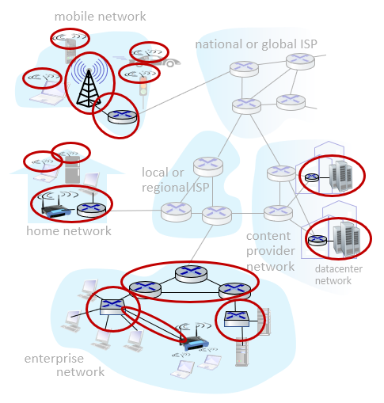

## ch1 Introduction: Network edge - hosts, access network, physical media

# A closer look at Internet structure

**Network edge:**

- hosts: clients and servers
- servers often in data centers

> 네트워크의 가장 가장자리에는 client와 서버가 위치
>
> 서버 컴퓨터는 데이터 센터 건물에 모여있다

**Access networks, physical media:**

- wired, wireless communication links: 링크들

  > edge 쪽에 가까운 네트워크들

**Network core:**

- interconnected routers: 라우터들도 서로 연결되어있음

- network of networks: 여러 네트워크를 연결해서 하나의 거대한 네트워크를 이룸

  > 네트워크의 중심부에는 여러 ISP와 연결된 라우터들이 모여있고, 그 라우터들을 연결해주는 core network가 있다

# Access networks and physical media

Q: How to connect end systems to **edge router**?; 내 컴퓨터에 가장 가까운 라우터와 어떻게 연결되는 걸까?

- residential access nets
- institutional access networks (school, company): 학교/회사 네트워크
- mobile access networks (WiFi, 4G/5G): 보통 집에서 쓰는거

# Access networks

## Wireless access networks

shared wireless access network connects end system to router: WAN(와이파이 ...)은 end system을 라우터에 연결시켜준다 (데이터 계층 이야기)

**Wireless local area networks (WLANs)**

- typically within or around building (~100 ft): 건물 안 등에 있고(개인 단위가 제공) 범위가 좁다
- 802.11b/g/n (WiFi 표준버전): 11, 54, 450 Mbps transmission rate; 다양한 bandwidth

**Wide-area celluar access networks**

- provide by mobile, cellular network operator (10's km): 통신회사가 기지국 통해 제공하는 네트워크, 범위 넓음
- 10's Mbps: 대역폭 고정
- 4G/5G cellular networks: 폰에서 모바일 데이터 사용할 때 쓰는거

## Access networks: home networks

라우터에 케이블과 와이파이가 연결되어 있고, 인터넷 연결이 필요한 장치들을 케이블이나 와이파이에 연결해서 사용함 (케이블에 장치를 직접 연결하기도 함)

## Access networks: enterprise networks

- companies, universities, etc.
- mized of wired, wireless link technologies, connecting a mix of switches and routers
  - Ethernet: wired access at 100Mbps, 1Gbps, 10Gbps
  - Wifi: wireless access points at 11, 54, 540 Mbps

>회사 네트워크는 유선으로 하는게 기능/경제상 유리함. 회사 내부망은 유선으로 연결되어있고 모두 한 라우터에 연결되어 있다. 이 라우터는 회사 밖의 네트워크로 연결해주는 라우터
>
>그림에서 왼쪽 스위치에는 client들과 공유기가 직접 연결되어 있고, 오른쪽 스위치에는 회사 서버가 직접 연결되어 있다. 이 스위치들은 외부로 연결해주는 라우터를 통해 외부 네트워크에 접근 가능하다.

## Access networks: data center networks

- high-bandwidth links (수십에서 수백 Gbps) connect hundreds to thousands of servers together, and to Internet: 높은 대역폭을 가진 링크들을 통해 수백 수천개의 서버들이 연결되어 있음

  > 데이터 센터는 규모가 어느정도 큰 회사들이 보유함.
  >
  >  
  >
  > 책상 (rack)에 직육면체 서버가 무수히 쌓여있다. - 책상이 건물을 꽉 채움

# Hosts: sends packets of data

성능에 관련된 이야기~

host sending function:

- takes application message: 상위계층에서 받은 메세지를
- breaks into smaller chunks, known as **packet**, of length **L bits**: L bit 길이의 패킷으로 잘라서
- transmits packet into access network at **transmission rate R**: 폭(transmission rate)이 R bps인 파이프(링크)를 통해 하나의 패킷을 흘려보내는데 걸리는 시간을 계산해보자
  - link transmission rate, aka **link capacity**, aka **link bandwidth**

> packet transmission delay: dtrans
>
> = time needed to transmit L-bit packet into link: L-bit 크기의 패킷을 R bps의 링크안으로 넣는데 걸리는 시간
>
> = L (bits) / R (bits/sec): 패킷 크기 / 링크 폭

# Links: physical media

physical media는 physical(1계층) & data link(2계층) 레이어의 영역

- **bit:** propagates between transmitter/receiver pairs; 전달자와 받는자 사이에 이동하는 것은 비트
- **physical link:** what lies between transmitter & receiver; 전달자와 받는자 사이를 연결해주는것이 링크
- **guided media:** 유선 링크
  - signals propagate in solid media: ~~copper~~, fiber(광섬유), ~~coax~~
- **unguided media:** 무선 링크
  - signal propagate freely, e.g., radio

### Twisted pair (TP)

- two insulated copper wires

  - Category 5: 100 Mbps, 1 Gbps Ethernet
  - Category 6: 10 Gbps Ethernet

  > LAN cable이 연결되어있다는 것은 ethernet 통신을 한다는 것, ethernet cable과 UTP cable은 같은 것으로 보면 됨
  >
  > TP는 많이 사용되고 저렴한 유선 링크(guided media)로 카테고리 6을 주로 씀

