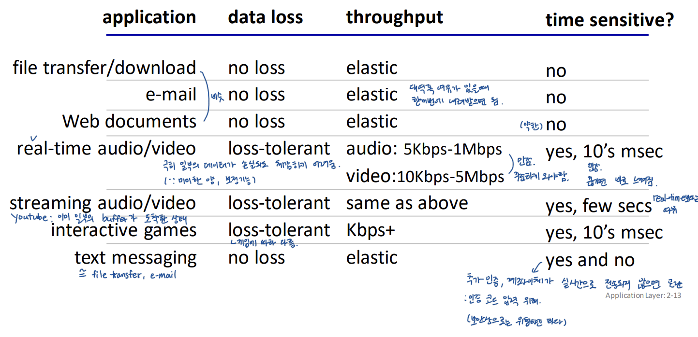
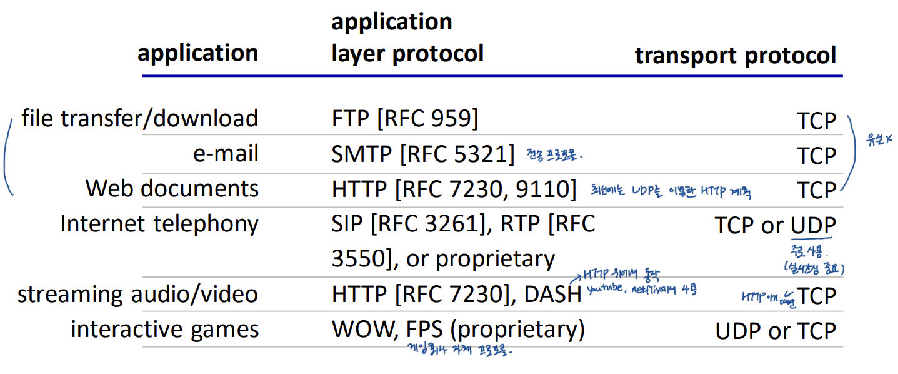

## ch2 application layer: \#1 principles of network applications

# Application layer: overview

- conceptual and implementation aspects of application-layer protocols: 개발할 때 고려사항
  - transport-layer service models: application layer가 transport layer의 어떤 서비스를 이용하는지
  - client-server paradigm: application layer model 1
  - peer-to-peer paradigm: application layer model 2 
- protocols: HTTP, DNS, video streaming systems, CDNs
- programming network applications: socket API (network programming; cleint의 server program)

# Creating a network app

write programs that:

- run on (different) end systems: 관심부분은 오직 end system, end system 이외의 것은 black box
- communicate over network: e.g., web server software commuicates with browser software

no need to write software for network-core devices: core의 소프트웨어 프로그램을 작성하는 것이 아니다 (core는 application의 영역이 아님)

# Application layer models

## Client-server paradigm

server:

- always-on host: 서버는 항상 살아있다고 가정
- permanent IP address: IP가 변경되면 서버에 접근 어려움 (domain-IP mapping이 유지되어야 접근 가능)
- often in data centers, for scaling: data center에 server 컴퓨터들이 잔뜩 모여있음, 요즘 회사는 자사의 서버를 서버 회사의 data center에 관리 요청

clients:

- contact, communicate with server: 서버와 통신함
- may be intermittently connected: client는 항상 살아있지 않음
- may have dynamic IP addresses: IP가 고정될 필요 없음, 보통 집 컴퓨터는 고정 IP가 아님 (그래서 집 컴을 서버로 두려면 우회루트를 찾아야함)
- do not communicate directly with each other: client끼리는 직접 통신 안함

examples: HTTP(web), IMAP(e-mail), FTP(file transfer) 등등 P2P 제외한 거의 전부

## Peer-peer architecture

peer: client역할을 하기도 하고 server 역할을 하기도 함

- no always-on server: 항상 연결되어있는 서버(노드) 없음
- arbitrary end systems directly communicate: 아무 end system끼리 직접 통신 가능 - client가 직접 연결되어 경우에 따라 server가 되기도 함
- peers request service from other peers, provide service in return to other peers: self scalability(확장성) - new peers bring new service capacity, as well as new service demands: 새로운 노드가 새로운 서비스를 가져오면 다른 노드들도 사용 가능 - computing up, storage up

- peers are intermittently connected and change IP addresses - complex management: 자기가 원하는 것을 취하면 network에서 빠져나가버리기 때문에 관리 어려움

example: P2P file sharing (요즘은 유튜브, 넷플릭스 때문에 많이 사그라들음)

# Processes communicating

**process**: program running within a host: 컴퓨터 내에서 실행되는 프로그램

- within **same host**, two processes communicate using **inter-process communication** (defined by os): **IPC** - 같은 컴퓨터 내의 프로그램들끼리 소통
- processes in **different hosts** communicate by exchanging **message**: 다른 컴퓨터에서 돌아가는 프로그램들은 서로 메세지를 주고받으며 소통

> client process: process that initiates communication: 서버에 contact 요청
>
> server process: process that waits to be contacted: client에게서 contact 요청 올때까지 대기

# Sockets

socket은 원래 UNIX 운영체제를 가진 컴퓨터에서 메세지를 주고받는 API였다가 거의 모든 운영체제에서 지원하고 있음: 다양한 환경(운영체제, 언어)에서 동작함

sender의 application L에서 메세지를 socket 인터페이스에 맞춰 작성해 socket을 통해 내보냄, receiver도 socket을 통해서 메세지 받아들임

network programming 할 때 필수로 사용, socket 프로그램 작성 시 transport L의 어떤 프로토콜을 사용할 것인지 결정해야함.

- process sends/receives message to/from its **socket**: socket을 통해서 메세지 주고받음 - application L와 transport L 사이에 위치하기 때문에 당연히 end system에서 동작
- socket analogous to door: socket은 일종의 문 같은 것임 (application L은 강의실 안이고, socket 밖의 Internet은 복도; 복도는 blackbox)
  - sending process shoves message out door: 메세지를 socket(문) 밖으로 내보냄
  - sending process relies on transport infrastructure on other side of door to deliver message to socket at receiving process: application L은 transport L의 서비스를 이용, application L은 app developer에 의해 동작하고, transport L부터는 OS에 의해 동작함
  - two sockets involved: one on each side: socket(문)은 sender, receiver 양 측에 위치

# Addressing processes

- to receive messages, process must have **identifier**: 메세지를 보낼 때 어느 프로세스로 보낼지 지정해줘야 하기 때문에, 각각의 프로세스는 각자의 ID가 필요; 포트번호로 프로세스 지정해줌
- host device has unique 32-bit IP address: 호스트는 32 비트 길이의 IP주소 ID 가짐 (32-bit는 IPv4 버전, 더 좋은 것도 한참 전에 나왔지만 배포를 못하고 있는 상황; 사용자가 너무 많아서); IP 확인해서 특정 host까지 데이터를 전달해주는 것은 network L의 역할
  - 한 컴퓨터에 여러 개의 network interface가 연결된 상태면 그 컴퓨터의 IP도 여러개이다. 같은 이유로 router는 여러 network와 연결되어 있으므로 연결된 network 수 만큼의 multi IP 가짐
- **identifier** includes both **IP address** and **port numbers** associated with process on host: 즉 특정 메세지를 보내기 위해서는 두 가지 ID가 필요 - host를 구분해주는 IP와 process를 구분해주는 port number
- example port numbers: HTTP server: 80, mail server: 25

# An application-layer protocol defines:

application L의 프로토콜이 결정하는 것들

- **types of messages exchanged:** e.g., request, response, 도메인에 대한 IP를 DNS server가 알려줌

- **message syntax:** what fields in messages & how fields are delineated; 어떤 incoding으로 감싸서 보낼지

- **message semantics:** meaning of information in fields

- **rules** for when and how processes send & respond to message

application L의 프로토콜 종류들

**open protocols:** 표준화된 프로토콜; 누구나 사용 가능

- defined in RFCs, everyone has access to protocol definition
- allows for interoperability
- e.g., HTTP, SMTP(e-mail)

**proprietary protocols**: 특정 제품에서 쓰는 프로토콜

- e.g., Skype, Zoom

example: 웹이 동작하기 위해서 application L에는 웹과 (웹을 지원하는) HTTP 프로토콜이 존재

# What transport service does an app need?

transport L이 application L에 어떤 서비스를 제공하는지

## data integrity

> 온전한 데이터 전달 보장; 무결성
>
> - some apps (e.g., file transfer, web transactions) require 100% reliable data transfer
>- other apps (e.g., audio) can tolerate some loss
> 
> 온전한 데이터 전송을 요구하는 경우도 있고, overhead가 커서 포기하는 경우도 있다

## timing

> - some apps (e.g., Internet telephon; Skype, interactive games) require low delay to be "effective"
>
> application마다 요구하는 delay가 다름

## throughput

> 어느 정도의 throughput(전송 속도)이 일정하게 유지되길 요구
>
> - some apps (e.g., multimedia) require minimum amount of throughput to be "effective"
>- other apps ("elastic apps") make use of whatever throughput they get
> 
> 실시간으로 받을 필요가 없는 앱들은 throughput에 민감하지 않음

## security

> - encryption, data integrity, ...
>
> solution의 도움을 받아야 함: **SSL, TLS ..**

# Transport service requirements: common apps

# Internet transport protocols services

application 관점에서의 transport L의 프로토콜 동작; transport는 process to process

## TCP service:

- **reliable transport** between sending and receiving process: 내가 보낸 데이터가 순서대로 손상없이 목적지에 도착 by 재전송

  > network L: best effort; 신뢰성 없음 --(dilema)--> transport L: 신뢰성 보장
  >
  > => TCP가 재전송으로 신뢰성 보장

- **flow control**: sender won't overwhelm receiver

  > 하나의 호스트 쌍 사이에서 혼잡 발생시 (A 컴퓨터와 B 컴퓨터 사이); 앞차(A컴)가 뒤 차(B컴)한테 좀 천천히 오라고 함
  >
  > 흐름 제어: sender가 너무 빠르게 보내면 receiver가 천천히 보내라고 함; 예약제가 아니기 때문에 받을 자리가 없을 수 있다.

- **congestion control**: throttle sender when network overloaded

  > network core에서 문제가 발생시 고속도로(network core)가 혼잡하니 차를 끌고 나오지 말라고 함 (데이터 전송 제한)
  >
  > 반면 UDP는 congestion control 없음: core가 혼잡하든 아니든 상관없이 차를 갖고 나와버림

- **connection-oriented:** setup required between client and server processes

  > A컴 안의 특정 process와 B컴 안의 특정 process 연결 설정; 어떻게 연결할지 사전 약속
  >
  > 이때 network 내부는 모른다; black box 신경 안씀 

- does not provide: timing, minimum throughput guarantee; 대역폭 보장 못함, security; 필요하면 SSL, TLS 갖다쓰면 됨

## UDP service:

- **unreliable data transfer ** between sending and receiving process

  >온전한 전송 보장 못함: best effort -> 포트 넘버를 지정하는 것 외에 딱히 하는 게 없다; network L이 IP 지정하는 것처럼
  >
  >때문에 network L과 하는 일이 비슷하다고 해서 UDP datagram이라고 부르기도 함; datagram은 network L의 데이터 전송 단위, segment는 transport L의 데이터 전송 단위

- does not provide: reliability, control, congestion control; 여기까지는 TCP는 지원하는 것들, timing, throughput, guarantee, security, or connection setup; TCP도 지원 안하는데 UDP도 당연히 지원 안함

그럼 왜 UDP를 사용할까? -> 이 질문에 대한 답을 어디서 배우게 되었더라..

# Internet applications, and transport protocols

# Securing TCP

**Vanila TCP & UDP sockets:** 인터넷 초창기에는 security에 대한 관심 없었음; 날것 그대로의 프로토콜

- no encryption: 암호화 없음; snipping으로 데이터 다 빼돌릴 수 있음
- cleartext password sent into socket traverse Internet in cleartext: 심지어 패스워드도 그냥 보내버림

**Trasport Layer Security (TLS)**: TLS 이전의 것이 SSL, 가장 최신 버전은 TLS 1.3; e.g., https는 http를 TLS를 통해서 보내겠다는 의미

- provide encrypted TCP connections: 암호화 함
- data integrity
- end-point authentication: 상대방 서버가 본인이 맞는지 확인

TLS implemented in application layer: TLS는 socket과 같은 위치(application L과 transport L의 경계)에 위치함. 환경에 따라 API 사용하면 TLS 사용 가능

- apps use TLS libraries, that use TCP in turn: TCP로 전송할 때 TLS 라이브러리 사용 가능
- cleartext sent into "socket" traverse Internet encrypted: 소켓을 통해 보내진 cleartext가 암호화되어 Internet으로 보내지게 됨

