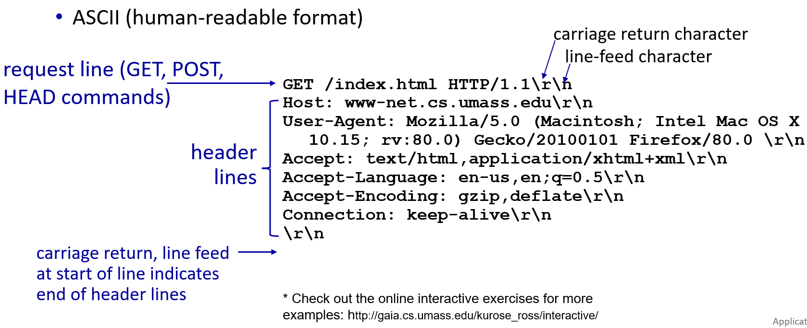
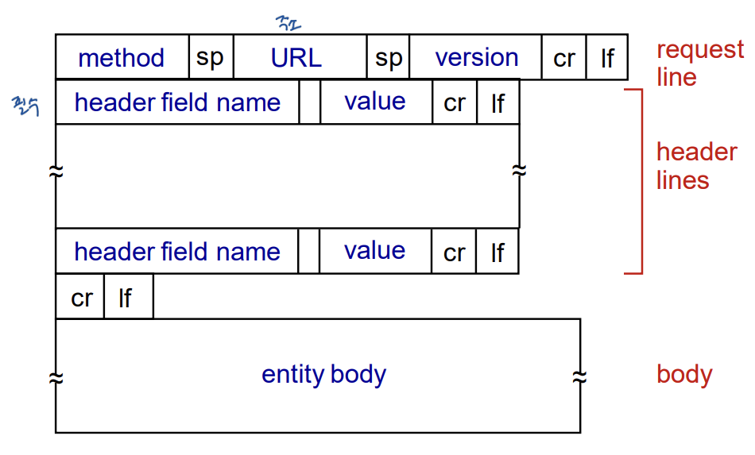
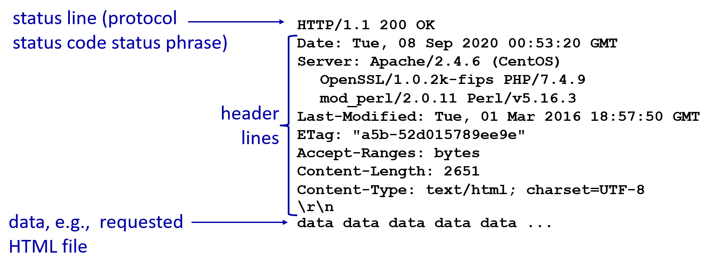

## ch2 application layer  \#2 web and http: http request message

two types of HTTP messages: **request**, **response**

# HTTP "request" message

request line에서 commands보다 methods가 더 정확

`\r\n` 은 다음줄로 넘어간다는 의미

맨 마지막 줄의 `\r\n` 은 header의 끝을 의미, 즉 그 밑에서부터는 데이터 부분

## general format

'어디에서 가져올 것이냐'가 가장 중요한 정보

## Other HTTP request messages

**<u>POST method:</u>**

- web page often includes **form input**: form을 채워서 submit 할 때 (설문지 작성해서 내는 것처럼)
- user input sent from client to server in entity body of HTTP POST request message

**<u>GET method</u>** (for sending data to server):

- include user data in URL field of HTTP GET request message (following a `?`): request message에 검색 키워드 보냄

  `http://www.somesite.com/animalsearch?monkeys&banana`

  > 가장 많이 쓰는 request message
  >
  > `?` 뒤에는 client가 검색한 내용

**<u>HEAD method:</u>**

- requests headers (only) that would be returned if specified URL were requested with an HTTP HEAD methods.

  > 개발자들이 사용
  >
  > test위해 HEAD만 가져옴: object를 가져올 수 있는지 확인 위해

**<u>PUT method:</u>**

- upload new file (object) to server: 업로드 할 때
- completely replaces file that exists at specified URL with content in entity body of POST HTTP request message

# HTTP "response" message

`Last-modified`: time stamp

`ETag`: hash value; 해시값 대조해서 요청한 내용 맞는지 확인

> 해시함수: input에 상관없이 output 크기 고정, input 조금만 바꾸면 output 크게 달라짐

## HTTP response status codes

- status code appears in 1st line in server-to-client response message: response message의 가장 첫 줄이 status code

- some sample codes (format: 에러 번호 + 부연 설명):

  **200 OK** 

  - request succeeded, request object object later in this message: (제대로 보내지면 content가 보이기 때문에) 실제로 볼 일은 없음

  **301 Moved Permanently** 

  - request object moved, new location specified later in this message (in Location: field): 요청한 object가 딴 데로 옮겨갔다고 말해줌

  **400 Bad Request**

  - request msg not understood by server: syntax error와 비슷하게 이해하면 됨; request 메세지를 이해하지 못해서 답 못하겠다는 뜻

  **404 Not Found**

  - request document not found on this server: 클라이언트가 지정한 파일을 찾을 수 없을 때

  **505 HTTP Version Not Supported**

  - 해당 content의 HTTP 버전을 지원 안함

