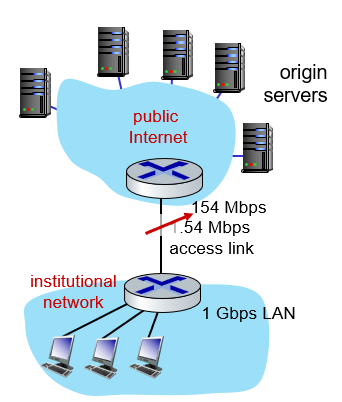
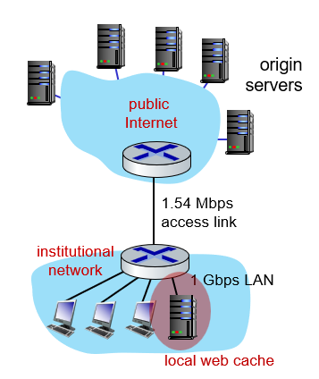

## application layer: cookies & Web caches

# Cookies

## Maintaining user/server state: cookies

HTTP는 stateless: 모든 객체를 독립적으로 취급

-> state를 유지하기 위해 쿠키를 사용

네 가지 요소로 작동

1. HTTP response_msg의 쿠키 헤더
2. 다음 HTTP req_msg의 쿠키 헤더
3. 유저의 호스트에서 유지되는 쿠키 파일과, 유저의 브라우저에서 유지되는 쿠키 파일
4. 웹 사이트의 백엔드 데이터베이스

Example:

아마존 서버에 클라이언트가 처음 접근하면 

1. 아마존 서버가 유저를 위한 쿠키 아이디를 만들어서 response msg에 담아 전달
2. 클라이언트는 쿠키 파일에 그 메세지에 있는 쿠키 아이디를 전달
3. 다음에 아마존 서버에 접근할 때 쿠키 헤더에 아이디를 넣어서 request msg 전달하면
4. 아마존 서버가 내부의 데이터베이스에서 cookie 아이디 검색해서 쿠키에 맞는 response msg 전달

쿠키를 일부러 지우기 전까지 유지됨

## HTTP cookies: comments

authorization, 장바구니, 맞춤 광고 등에 사용됨

How to keep state?

- at protocol endpoints: end-system에 상태 유지
- in messages: HTTP에 쿠키 정보 담음

## Cookies: tracking a user's browsing behavior

내가 접속하려는 사이트에서는 first party cookie가 생성

내가 의도하지 않게 사이트와 연결된 광고 서버에서 third party cookie가 생성

여러 사이트가 그 광고 사이트에 연결되어 있으면, 그 광고 사이트의 서버는 내가 방문했던 사이트의 히스토리를 데이터베이스에 다 저장하고 있음

# Web caches (aka proxy servers)

origin server까지 접속할 필요 없이 local에 위치한 web cache에서 대신 response msg를 받아옴

>ISP에서 origin server까지 traffic이 극심할 경우 (라우터와 라우터를 잇는 링크가 정체)
>
>
>
>option 1: 더 빠른 라우터 사이를 잇는 access link를 삼 -> 성능은 개선되지만 너무 비쌈
>
>end-end delay = Internet delay + access link delay (이게 빨라짐) + LAN delay
>
>
>
>option2: local network 안에 웹 캐시를 설치한다.
>
>웹 캐시의 hit rate이 0.4 라면 (hit rate: 요청한 web object가 웹 캐시에 존재하는 비율)
>
>avg end-end delay = 0.6 * (delay from origin servers) + 0.4 * (delay when satisfied at cache)
>
>-> 싸고 빠름

## Browser caching: Conditional GET

캐시에 저장된 내용이 최신인지 판단은 서버가 함

목적: 브라우저가 가장 최신 버전의 object를 가지고 있으면 서버가 굳이 object를 보내지 않기 위해

client: 특정 날짜 이후로 수정되었냐고 서버에게 물어봄

- `If-modified-since: <date>`: 이 날짜 이후로 수정되었다면 나에게 object 보내달라

server: 특정 날짜 이후로 update가 되었으면 object 보내주고 아니면 헤더만 보냄(안바뀌었다고)

- `HTTP/1.0 304 Not Modified`: 그 이후로 수정 안되었다고 헤더만 response
- `HTTP/1.0 200 OK`: 그 이후로 수정되었으면 최신 object 보냄

