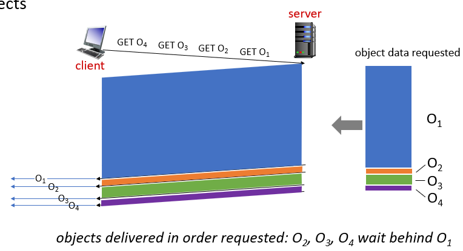
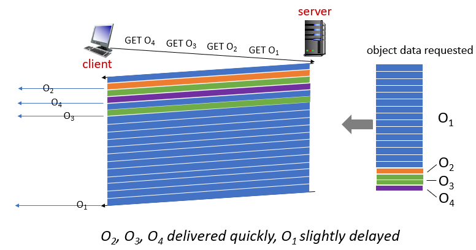

## application layer: HTTP versions

# HTTP1.1

multiple, pipelined GETs over single TCP connection: single TCP로 여러 객체 보내는게 특징

서버가 요청을 받은 순서대로 응담 -> **HOL(head-of-line) blocking**

뒤쪽에 있는 object가 훨씬 작은 크기인데도 앞쪽의 커다란 거 먼저 보내느라 뒤에거는 오래 대기해야함

# HTTP/2

목표: 여러개의 object를 보낼때 delay를 줄이자

object priority 부여, object를 프레임 단위로 나눔

프레임 하나씩 우선순위에 따라서 한 바퀴씩 보냄

위 그림은 우선순위가 o1 < o2 < o3 < o4 인 경우

# HTTP/2 to HTTP/3

HTTP/2 문제점: 재전송 시 모든게 멈춤

-> HTTP/3는 UDP 사용해서 적은 제한을 통해 이동시킴 (부수적인 기능은 상위 레이어에서 구현)

