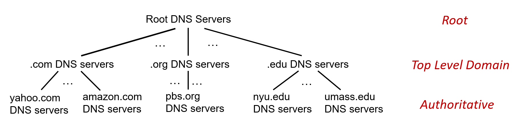
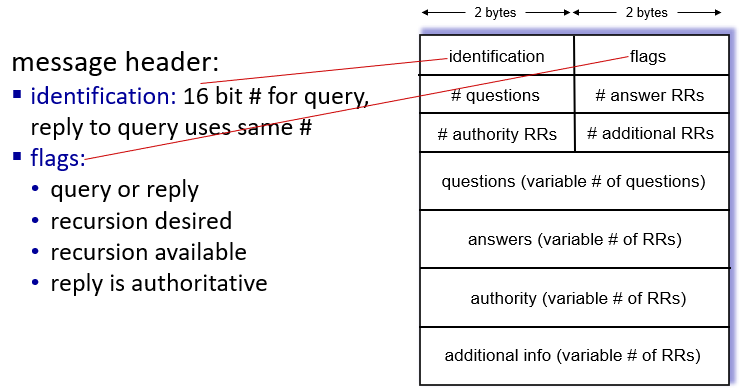
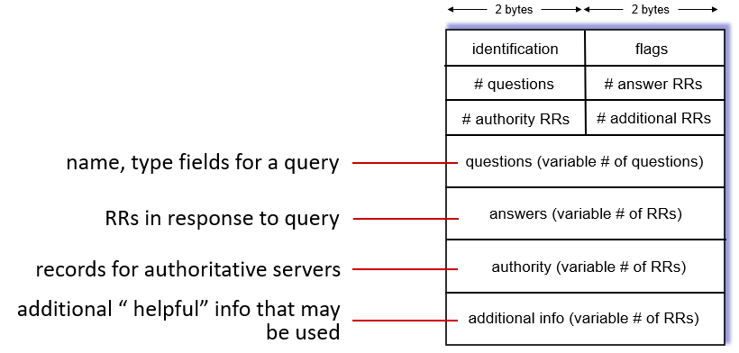

## application layer: The Domain NAme System DNS

# DNS: Domain Name System

IP 주소는 사람이 직관적으로 이해하기 어려움

사람이 직관적으로 이해할 수 있는 주소가 DNS

DNS는 많은 네임 서버들의 계층 구조로 이루어진 분산 데이터 베이스

application-layer protocol 임: host와 DNS 서버는 name을 resolve(번역) 하기 위해 communicate

# DNS: a distributed, hierarchical database

계층 구조: Root server -> TLD server -> Authoritative server

위의 계층이 아래 계층의 어느 도메인 서버에 물으면 답을 알 수 있는지 알려줌

- 답을 알만한 서버를 소개

# Local DNS name servers

모든 ISP는 각각 local DNS name server를 가지고 있다

호스트가 DNS 쿼리를 만들어서 로컬 DNS 서버에 보내면 호스트에게 IP 주소를 넘겨줌

로컬 DNS 서버는 답을 알고 있으면 (자신의 캐시정보에 들어있으면) 바로 응답하고 모르면 다른 DNS 서버에게 물어봄

- **Iterated query:** 로컬 DNS 서버가 물으면 알 것 같은 서버 주소를 알려줌; 로컬이 질문 여러번 (이게 보통)
- **Recursive query:** 로컬한테 질문받은 서버가 알 것 같은 서버에게 직접 물어보고 답을 보내서 다시 전달 반복; 로컬이 질문 한 번만 함 (보통 지원 안함; 상위 계층 DNS에 부담이 커지니까)

한번 매핑한 것은 캐시 정보에 들어가 있어서, 같은거 또 물으면 캐시 안에 있는 정보로 바로 응답

# DNS records

DNS: distributed database storing resource records (RR); DNS DB에 들어가있는 내용

RR format: (`name, value, type, ttl`); name과 value 매핑

- **type=A:** hostname(도메인 네임)과 IP 매핑
- **type=NS:** 도메인 네임과 이 도메인 네임을 관리하는 authoritative 네임 서버 이름 매핑
- **type=CNAME:** 별명과 실제 도메인 이름 매핑
- **type=MX**: 메일 서버(@뒤에 써있는거)의 도메인 네임 매핑

# DNS protocol messages

DNS query와 reply message는 같은 포맷 가짐

# DNS security

- DDOS attacks: 루트 서버에 트래픽 몰리게 함
- Spoofing attacks: DNS 쿼리를 가로채서 다른 IP로 돌려줌 (가짜 사이트)