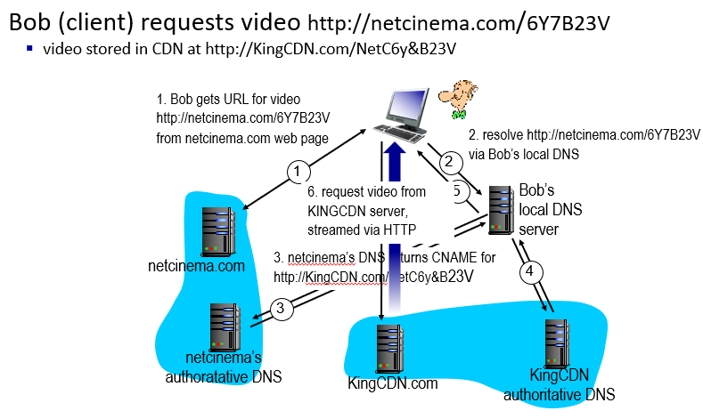

## application layer: video streaming and content distribution networks

# streaming stored video: playout buffering

클라이언트 쪽에서 버퍼가 쌓일동안 대기하였다가 play 시작; delay 정도가 뒤죽박죽 하므로

# Streaming multimedia: DASH

Dynamic, Adaptive Streaming over HTTP: 스트리밍 전용 프로토콜

server:

- 비디오 파일을 여러 조각(chunks)으로 나눠서
- 각 조각들을 다른 비율로 인코딩해놓음 (다른 화질로), 비율에 따라 다른 파일에 저장함
- 여러 CDN 노드들에 복제본 저장
- **maifest file:** client가 화질 선택하게 하는 메뉴판 URL 제공

client: "intelligence" at client

- 언제, 어느 encoding rate(화질)으로, 어느 URL(CDN)에서 요청할지 결정
- 한 번에 한 청크 요청

streaming video = encoding + DASH + playout buffering

# Content distribution networks (CDNs)

CDN은 컨텐트를 제공하는 서버들을 연결해주는 네트워크

수많은 사용자들에게 어떻게 (수백만개 중에서 선택된) 컨텐트를 보낼 수 있을까?

content 배포용 서버를 여러 곳에 배치: 이 서버가 CDN

- enter deep: 소규모를 여러 곳에 배치 / bring home: 조금 더 큰 규모를 적은 곳에 배치

아카마이, 넷플릭스 등등이 CDN 운영

# CDN content access: a closer look

보통 스트리밍 회사들이 아카마이 같은 CDN 운영 회사에 수수료 지불하고 이곳의 CDN을 사용함

netcinema의 DNS 서버에 물어보면 CNAME에 대한 DNS 서버를 응답해줌

그 DNS 서버가 실제 CDN 운영하는 회사의 네임서버