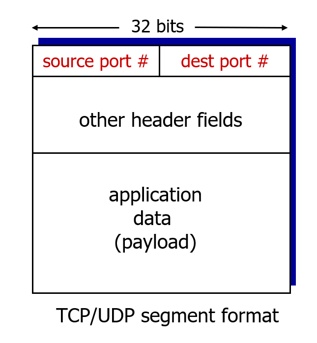
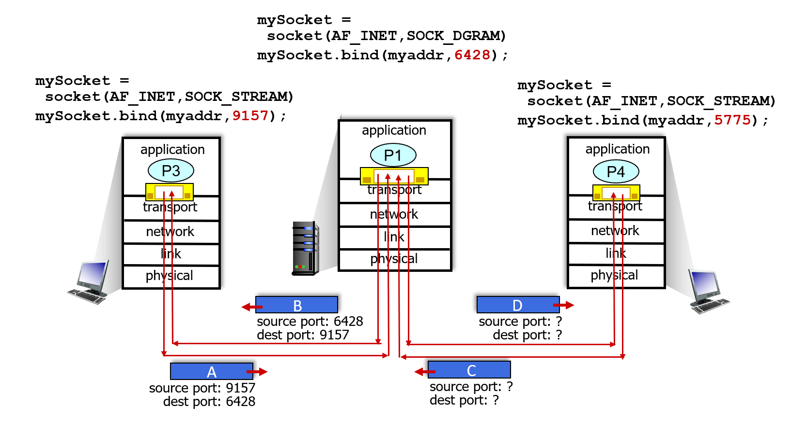
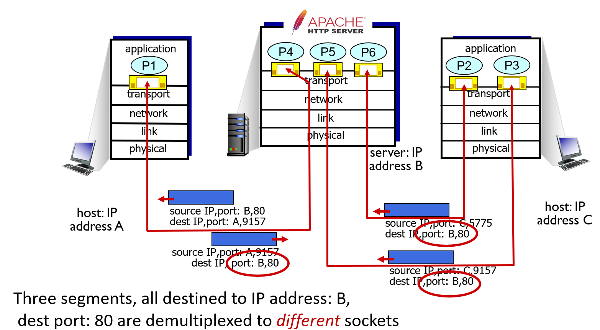

## ch3 transport layer: Multiplexing and demultiplexing


Q: how did transport layer know to deliver message to Firefox browser process rather then Netflix process or Skype process?

포트번호로 프로세스를 구분: (transport L의 전송단위인) 세그먼트의 헤더에는 포트 번호에 대한 정보가 있다. transport L은 포트 번호에 따라 해당 프로세스에 메세지를 전달한다.


# Multiplexing/demultiplexing

**multiplexing as sender:** 

handle data from multiple sockets, add transport header (later used for demultiplexing)

> 다중화: 어느 프로세스로 보낼지 지정
>
> 문(소켓) 밖으로 내보내진 택배 박스를 복도 관리인(transport L  protocol)이 문 정보 보고 프로세스 번호 붙여서 건물 관리인(network L)에게 넘김
>
> *프로세스=방, 소켓=프로세스가 있는 방의 문, transport L=복도 관리인, network L=건물 관리인 으로 대충 생각하면 이해됨*

**demultiplexing as receiver:**

use header info to deliver received segments to correct socket

> 역다중화: 명시된 프로세스로 넘겨줌
>
> 건물 관리인(network L)에서 전달받은 택배 박스의 포트 번호를 보고 해당 프로세스의 소켓에 넘겨줌


# How demultiplexing works

- host receives IP datagrams
  - each datagram has **source IP** address, **destination IP** address
  - each datagram carries one transport-layer segment: 데이터그램 = network L 헤더 + 세그먼트 한 개
  - each segment has **source destination port number**: 세그먼트는 목적지 포트 번호 정보가 헤더로 달려있음
- host uses **IP addresses & port numbers** to direct segment to appropriate socket: 호스트에서 IP와 port \#을 알면 해당 메세지가 도착해야 할 소켓을 특정지을 수 있음



>건물 관리인(network L)이 datagram을 받아들임. datagram의 헤더에 적혀 있는 src IP와 dst IP를 확인하고 해당 건물(host)에 오는 데이터가 맞으면 헤더를 뗴버리고 세그먼트로 만들어서 복도 관리인(transport L)에게 전달
>
>복도 관리인(transport L)이 건물 관리인(network L)로부터 segment를 받아들임. segment의 헤더에 적혀있는 src port \#과 dst port \#을 확인하고 헤더를 뗴버리고 메세지로 만들어서 해당 포트 번호를 가진 문(소켓)에 메세지 던져넣음. 메세지는 소켓을 통해 넘어가면서 원본상태로 복구된 채로 프로세스에게 전달. 
>
>헤더를 뗴버리는 과정은 TCP와 UDP에 따라 달라짐: 뒤에서 자세히 나옴
>
>당연한 소리지만 TCP가 UDP보다 많은 서비스를 제공하기 때문의 TCP segment의 헤더가 UDP segment의 헤더보다 훨씬 크기가 큼


# Connectionless demultiplexing: UDP

Recall:

- when creating socket, must specify **host-local port \#**:

  ```
  DatagramSocket mySocket1
    = new DatgramSocket (12345);
  ```

  > socket(문)을 만들 때는 port \# (방 번호) 지정해줘야 함

- when creating datagram to send into UDP socket, must specify

  - destination IP address
  - destination port \#

  >UDP 소켓으로 datagram을 보낼 때는 IP와 port \# 지정해서 보내야함
  >
  >*반면 TCP는 미리 소켓과 연결해놓은 상태이므로 이 과정 필요 없음: 한 TCP connection당 하나의 소켓이 할당되어 있기 때문*

- when receiving host receives UDP segment:

  - checks destination port \# in segment
  - directs UDP segment to socket with that port \#

  > UDP segment는 port \# 정보만 있으면 목적지 소켓으로 바로 연결됨

  => IP/UDP datagrams with **same dest.** **port \#**, but different source IP addresses and/or source port numbers will be directed to **same socket** at receiving host

  > source 주소가 다른 경우에도 같은 dest IP와 port \# 가지고 있으면 같은 소켓에 연결됨
  >
  > 즉, UDP socket은 '1대 다'로 연결되는 방식임

## Connectionless demultiplexing: an example



> UDP 소켓에 dst 포트 번호만 일치하면 연결 가능: dest port \#이 해당 프로세스 소켓의 port \#과 일치하면 세그먼트를 해당 소켓과 연결시킴.
>
> 각각 다른 소켓에서 출발한 메세지가 같은 곳의 소켓으로 도착함 (1대 다 connection)


# Connection-oriented demultiplexing: TCP

- TCP socket identified by 4-tuple:
  - source IP address
  - source port number
  - dest IP address
  - dest port number

- demux: receiver uses **all four values** (4-tuple) to direct segment to appropriate socket

>TCP 소켓 문을 열려면 네 가지 정보가 필요
>
>TCP의 listening socket은 client가 연결을 할 때마다 그 connection의 전담 소켓을 만들어냄. 특정 TCP segment가 도착하면 receiver의 listening socket이 해당 segment안의 4가지 정보와 일치하는 전담 소켓과 연결해줌 (1대 1 connection)

- server may support many simultaneous TCP sockets:
  - each socket identified by its own 4-tuple
  - each socket associated with a different connecting client

> 서버는 동시에 여러 개의 TCP 소켓을 운영: listening socket이 client가 연결 요청을 할 때마다 새로운 소켓을 만들어내기 때문
>
> 각 소켓은 특정한 client의 프로세스와 1대 1로 연결되어 있음

## Connection-oriented demultiplexing: example



> 세 개의 프로세스가 모두 같은 호스트의 같은 프로세스에 연결 요청을 하고 있는 상황: 각각 다른 소켓으로 연결됨 (하나의 프로세스 당 하나의 소켓이 할당됨)


# Summary

- Multiplexing, demultiplexing: based on segment, datagram header field values

  > Multiplexing: 보낼 process 결정; sender가 여러 소켓에서 나온 데이터에 헤더를 붙여서 segment로 만듦 (헤더에는 demultiplexing을 위한 정보 들어있음: TCP냐 UDP냐에 따라 달라짐)
  >
  > Demultiplexing: 받아들일 소켓 결정; receiver가 도착한 segment의 헤더를 보고 어느 소켓으로 보낼지 결정

- UDP: demultiplexing using destination port number (only)

- TCP: demultiplexing using 4-tuple: source and destination IP address, and port numbers

- Multiplexing/demultiplexing happen at *all layers*: 모든 계층에서 자신에게 오는 것이 맞는지, 어디로 보낼 것인지 확인하는 과정을 거침