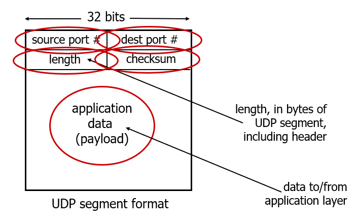
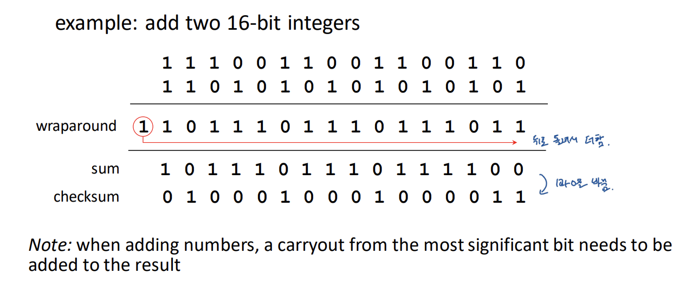
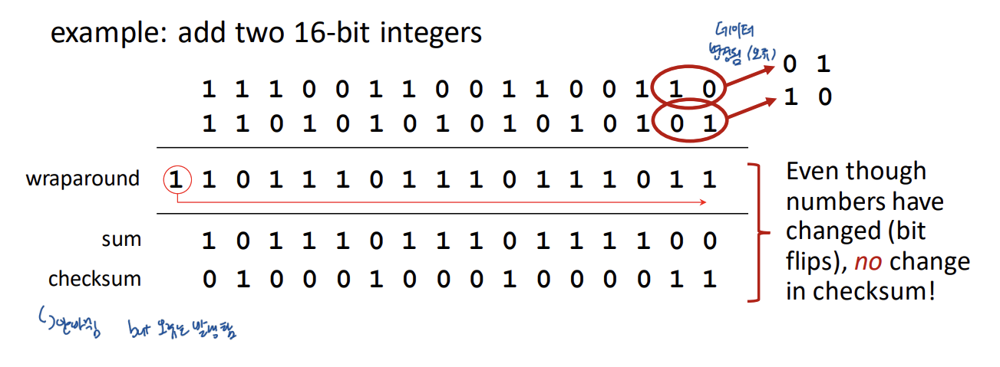

## ch3 transport layer: Connectionless transport - UDP

# UDP: User Datagram Protocol

- "no frills," "bare bones" Internet transport protocol: 날것의 형태; IP가 해놓은 것에 포트 번호만 붙여놓음
- "best effort" service, UDP segments may be: (난 최선을 다했지만 보장은 못해; 일부러 안해주려는게 아님)
  - lost: 데이터 유실 가능성 존재
  - delivered out-of-order to app: application L에 segment가 순서대로 도착할거라는 보장 못함
- **connectionless:**
  - no handshaking between UDP sender, receiver: 데이터 보내기 전 사전에 연결따위 하지 않음
  - each UDP segment handled independently of others: (각 프로세스 간 연결 따위 되어있지 않기 때문에) 각각의 UDP segment는 독립적으로 다룰 수 밖에 없음

> ## Why is there a UDP?
>
> 별 기능도 없는 것 같은 UDP 쓰는 이유
>
> - no connection establishment (which can add RTT  delay): 사전 연결 작업이 없기 때문에 1 RTT 만큼 delay 줄어듦
>
> - simple: no connection state at sender, receiver: 연결 상태 유지할 필요 없어서 간단
>
> - small header size: 데이터 크기가 작아서 congestion 뚫고 갈 가능성 높아짐
>
> - no congestion control (!!)
>
>   - UDP can blast away as fast as desired: 최대한 빨리 데이터 보내버릴 수 있음
>   - can function in the face of congestion: 혼잡이 발생해도 보내버림 (반면 TCP는 신사협정에 따라 혼잡시 데이터 보내기 자제함)
>
>   > TCP는 congestion 발생하면 데이터 전달 중단하지만
>   >
>   > UDP는 congestion 따위 신경 쓰지 않고 데이터 밀어넣기 때문에, 혼잡 상황에서도 데이터 도착 가능성 높아짐

- UDP use:

  - streaming multimedia apps (loss tolerant, rate sensitve): 한 두 frame정도 없어도 ok, 화질을 위해 (rate sensitive) UDP 씀
  - DNS: query를 "받으면 끝"
  - SNMP: 네트워크 관리 목적 프로토콜; 응답만 "받으면 끝"
  - HTTP/3: QUIK은 TCP말고 UDP 사용함 (지금 버전의 구글 크롬이 이거)

- if reliable transfer needed over UDP (e.g., HTTP/3):

  - add needed reliability at application layer
  - add congestion control at application layer

  > 추가적인 기능이 필요하다면 application L이 알아서 추가하라고 떠넘김

# UDP: Transport Layer Actions

UDP sender actions:

- is passed an application layer message: application L에서 메세지를 받아서
- determines UDP segment header fields values: 세그먼트의 헤더 결정해서
- creates UDP segment: 메세지에 헤더 붙여서 세그먼트 만듦
- passes segment to IP: IP한테 세그먼트 넘김

UDP receiver actions:

- receives segment from IP: IP로 부터 세그먼트 받음
- ~~checks UDP checksum header value: 세그먼트 헤더의 체크섬 value 일치 확인~~
- extracts application layer message: 세그먼트에서 헤더 떼어버리고 메세지 추출
- demultiplexes message up to application via socket: 소켓을 통해서 조각난 메세지들 모아서 원본 메세지로 복원시킴 (메세지를 세그먼트로 전환하는 과정에서 메세지 여러 조각으로 나뉨)

# UDP segment header

위의 두 줄이 Header 부분, 밑의 application data가 data 부분

checksum은 데이터가 전송 중 변경되었는지 확인하기 위한 것: 너무 단순해서 요즘에는 checksum 무시하고 받기도 함

# Internet checksum

Goal: detect errors (i.e., flipped bits) in transmitted segment

> noise 발생해서 flop된 경우 정도 감지 가능 (보안에는 택도 없음)

sender:

- treat contents of UDP segment (including UDP header fields and IP address) as sequence of 16-bit integers: segment를 16-bit 데이터들의 배열로 취급
- checksum: addition (one's complement sum) of segment content: 1의 보수를 더함
- checksum value put into UDP checkum field: 계산한 값을 checksum field에 넣음

receiver:

- compute checksum of received segment: 도착한 segment 데이터에 대한 checksum 계산
- check if computed checksum equals checksum field value: 계산된 값과 checksum field에 저장된 값을 비교
  - not equal - error detected
  - equal - no error detected. But maybe error nonetheless? More later ...

## Internet checksum: an example

두 16 bit 짜리 정수를 더해서 flip 시킴(1의 보수 형태로 만들기 위해)

## Internet checksum: weak protection!

checksum에 오류가 있다 -> 100% 오류

checksum에 오류가 없다 -> 100% 오류가 없다고 보장 못함 => 큰 역할 못함 (별 의미 없음)

# Summary: UDP

- "no frills" protocol:

  - segments may be lost, delivered out of order
  - best effort service: "send and hope for the best"

  > 딱히 대단한 것을 제공하지 않음 -> 단점으로만 보기 어려움

- UDP has its plusses:
  - no setup/handshaking needed (no RTT incuured): 미리 연결 안해도 됨; 1 RTT 단축
  - may function(go through) even when network is congested: 혼잡이 발생해도 이기적으로 행동하는 UDP는 데이터 보내버림 (TCP는 신사협정을 통해 데이터 이동 제한시킴)
  - ~~helps with reliability (checksum)~~: checksum 별 도움 안된다니까.
- build additional functionality on top of UDP in application layer (e.g., HTTP/3): UDP가 지원하는 서비스가 너무 부실하다고 생각하면 application L한테 떠넘겨서 서비스 만들게 하면 됨; HTTP/3가 그런 식으로 동작함. 얘가 곧 정착할것 같음

