## ch3 transport layer: Principles of reliable data transfer - TCP

# Principles of reliable data transfer

Complexity of reliable data transfer protocol will depend (strongly) on characteristic of (lose, corrupt, reorder data?)

> application L: transport L에게 reliable한 데이터 보내달라고 요청함
>
> network L: reliable 보장 못함
>
> => 사이에 낀 transport L protocol: 어쩌라는 걸까

Sender, receiver do not know the "state" of each other, e.g., was a message received?

- unless communicated via a message

> 게다가 sender와 receiver는 서로의 상태를 모른다; 중간의 network는 blackbox
>
> 결론적으로 transport L의 protocol은 환장할 만한 조건에서 reliable하게 데이터를 보내라는 임무를 부여받은 것이다.

# Reliable data transfer protocol (rdt): interfaces

rdt: reliable data transfer  /  udt: unreliable data transfer

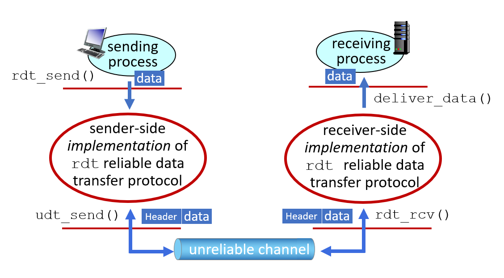

**rdt_send():** called from above, (e.g., by app.). Passed data to deliver to receiver upper layer

> sender의 application L이 호출: receiving process에 데이터를 reliable하게 전달해줘

**udt_send():** called by `rdt` to transfer packet over unreliable channel to receiver

> sender의 transport L이 호출: receiver에게 reliable 상관없이 패킷을 전달해줘

**rdt_rcv(): ** called when packet arrives on receiver side of channel

> receiver의 transport L이 호출: reliable한 패킷을 받아줘

**deliver_data():** called by `rdt` to deliver data to upper layer

> receiver의 transport L이 호출: 데이터를 application L에 전달해줘

# Reliable data transfer: getting started

We will:

- incrementally develop sender, receiver sides of <u>r</u>eliable <u>d</u>ata <u>t</u>ransfer protocol (`rdt`): rdt를 간단한 버전부터 시작해서 점점 발전시켜 나갈것임
- consider only unidirectional data transfer: 한 쌍의 sender와 receiver만 고려
  - but control info will flow in both directions!

- use finite state machine (FSM) to specify sender, receiver

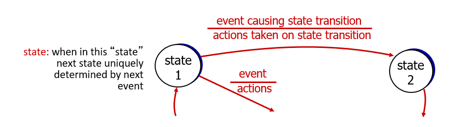

> 노드: 현재 상태
>
> 화살표: 상태 변화 방향; transition
>
> 화살표에 붙은 분수
>
> - 분자: transition 발생 조건 event
> - 분모:  transition 발생시 action

# rdt2.0

## rdt2.0: FSM specifications

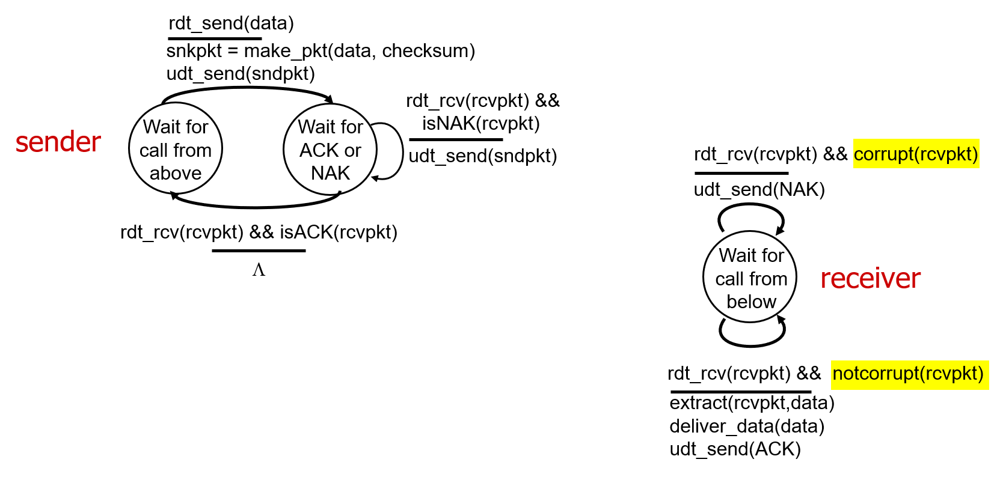

sender:

- wait for call from above -> wait for ack or NAK:
  - application L이 데이터 보내달라고 하면 (`rdt_send(data)`) / 패킷을 만들어서 (`sndpkt = make(data, checksum)`) network L에게 보냄 (`udt_send(sndpkt)`)
- wait for ACK or NAK -> wait for ACK or NAL:
  - receiver에게서 응답 패킷을 받고 (`rdt_rcv(rcvpkt)`) 그 패킷이 NAK를 담고 있으면  (`isNAK(rcvpkt)`) / network L에게 재전송 (`udt_send(sndpkt)`)
- wait for ACK or NAK -> wait for call from above: 
  - receiver에게서 응답 패킷을 받고 (`rdt_rcv(rcvpkt)`) 그 패킷이 ACK을 담고 있으면 (`isNAK(rcvpkt)`) / 아무것도 안함; 패킷이 제대로 보내졌구나라고 인식

receiver:

- wait for call from below -> wait for call from below:
  - sender가 보낸 패킷을 받고 (`rdt_rcv(rcvpkt)`) 그 패킷이 훼손뒈지 않았으면 (`notcorrupt(rcvpkt)`) / 패킷에서 데이터를 추출해 (`extract(rcvpkt, data)`) 그 데이터를 application L에 보낸 후 (`deliver_data(data)`) sender에게 ACK를 보냄 (`udt_send(ACK)`)
  - sender가 보낸 패킷을 받고 (`rdt_rcv(rcvpkt)`) 그 패킷이 훼손되었다면 (`corrupt(rcvpkt)`) / sender에게 NAK을 보냄 (`udt_send(NAK)`)

Note: "sate" of receiver (did the receiver get my message correctly?) isn't known to sender unless somehow communicated from receiver to sender

- that's why we need a protocol!

  > sender는 receiver의 상태를 알지 못함. (receiver에 커튼이 처져 있는 것으로 인식.) 
  >
  > 때문에 receiver가 내가 보낸 메세지를 잘 받았는지 안받았는지도 모름 (보낸 패킷이 유실이 되었는지, ack나 nak이 유실되었는지 등등)

## rdt2.0: operation with no errors

상위 레이어에서 데이터 보내달라는 요청이 오면 sender가 패킷을 만들어서 receiver에게 보냄

receiver가 패킷이 멀쩡하게 도착했다는 것을 확인하고 sender에게 ACK 보내고 상위 레이어에 데이터 전달

sender는 ACK를 받고 보낸 패킷이 제대로 도착했다고 생각, 초기 상태로 돌아감

## rdt2.0: corrupted packet scenario

상위 레이어에서 데이터 보내달라는 요청이 오면 sender가 패킷을 만들어서 receiver에게 보냄

receiver가 패킷이 훼손된채 도착했다는 것을 확인하고 sender에게 NAK 보냄

sender는 NAK를 받고 패킷 재전송

## rdt2.0 has a fatal flow!

what happens if ACK/NAK corrupted?

- sender doesn't know what happened at receiver: sender는 receiver에게 무슨 일이 일어나는지 모름
- can't just retransmit: possible duplicate: ACK가 훼손되었다면 똑같은 데이터를 불필요하게 재전송; receiver는 두 번 보내야 하는 데이터라고 착각하게됨

handling duplicates: 데이터를 중복으로 보내지 않게 하려면

- sender retransmits current pkt if ACK/NAK corrupted: ACK나 NAK가 훼손되면 sender가 같은 데이터를 재전송하니까
- sender adds *sequence number* to each pkt: sender가 각 패킷에 sequence 번호를 부여하자
- receiver discards (doesn't deliver up) duplicate pkt: 그러면 receiver는 중복되어 보내진 패킷을 버려버릴 것이다; 상위 레이어에게 전달하지 않는다

# rdt2.1: handling garbled ACK/NAKs

## rdt2.1: sender 

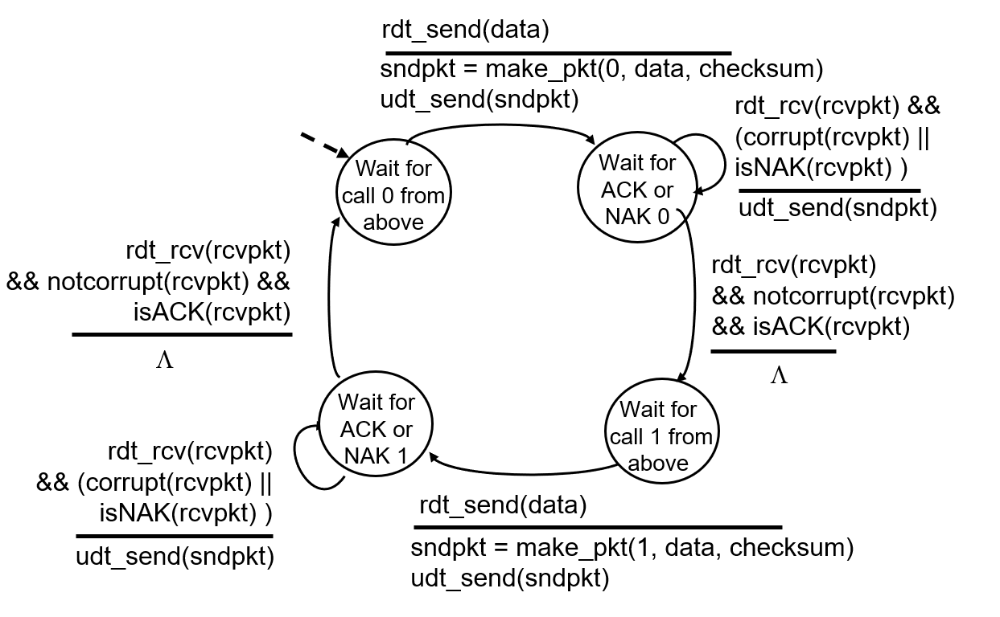

sender:

- wait for call 0 from above -> wait for ACK or NAK 0:
  - `rdt_send(data)`: 데이터 보내달라고 요청하면 / `sndpkt = make_pkt(0, dadta, checksum) && udt_send(sndpkt)`: 0번 패킷 만들어서 보냄

- wait for ACK or NAK 0 -> wait for call 1 from above:
  - `rdt_rcv(rcvpkt) && notcorrupt(rcvpkt) && isACK(rcvpkt)`: 응답받은 패킷이 훼손되지 않고 ACK 이면 / `Λ`: 아무것도 안함; 1번 패킷 대기 상태로 전환
- wait for ACK or NAK 0 -> wait for ACK or NAK 0:
  - `rdt_rcv(rcvpkt) && (corrupt(rcvpkt) || isNAK(rcvpkt))`: 응답받은 패킷이 훼손되거나 NAK이면 / `udt_send(sndpkt)`: 0번 패킷 재전송

sequence \#1일 때에도 똑같이 동작; 대칭된 형태

## rdt2.1: receiver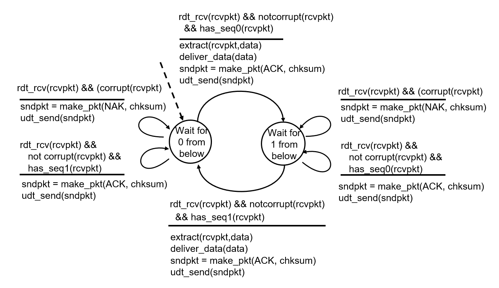

receiver:

- wait for 0 from below -> wait for 1 from below:
  - `rdt_rcv(rcvpkt) && notcorrupt(rcvpkt) && has_seq(0)`: 0번 패킷이 훼손없이 도착했다면 / `extract(rcvpkt, data) && deliver_data(data) && sndpkt = make_pkt(ACK, chksum) && udt_send(sndpkt)`: 데이터를 상위 레이어에 올려보내고 ACK 보냄

- wait for 1 from below -> wait for 1 from below:
  - `rdt_rcv(rcvpkt) && corrupt(rcvpkt)`: 받은 패킷이 훼손되었다면 / `sndpkt = make+pkt(NAK, chksum), udt_send(sndpkt)`: NAK 보냄
  - `rdt_rcv(rcvpkt) && not corrupt(rcvpkt) && has_seq0(rcvpkt)`: 0번 패킷이 훼손되지 않고 도착하면 / `sndpkt = make_pkt(ACK, chksum) && udt_send(sndpkt)`: ACK만 보내고 여전히 1번 패킷 대기상태; 1번이 올 차례에 0번이 왔다면 중복전송 되었다는 뜻이기 때문에 데이터를 위로 올려보내지는 않는다.

## rdt2.1: discussion

sender:

- seq \# added to pkt: 패킷에 번호 부여됨
- two seq. \#s (0 ,1) will suffice: 두 개의 번호면 충분한 이유는 stop and wait protocol을 가정하고 있기 때문
- must check if received ACK/NAK: ACK나 NAK의 훼손여부 체크
- twice as many states
  - state must "remember" whether "expected" pkt should have seq \# of 0 or 1: 지금 0번이 올 차례인지 1번이 올 차례인지 알고 있어야 함

receiver:

- must check if received packet is duplicate
  - state indicates whether 0 or 1 is expected pkt seq \#: 번호 보고 중복된 요청인지 구분 가능
- note: receiver can not know if its last ACK/NAK received OK at sender: receiver는 마지막으로 보낸 패킷이 sender에게 제대로 전송되었는지 모름

# rdt2.2: a NAK-free protocol

- same functionality as rdt2.1, using ACKs only: 2.1과 비슷하지만 ACK만 쓴다는 게 다름
- instead of NAK, receiver sends ACK for last pkt received OK: NAK 대신에 ok일 경우에만 ACK를 보냄
  - receiver must explicitly include seq \# of pkt being ACKed: ACK 보낼시 seq\# 같이 보내야 함
- duplicate ACK at sender results in same actions as NAK: retransmit current pkt; sender에게 번호가 일치하지 않는 ACK가 도착하면, 지금 보낸것이 제대로 도착하지 않았다고 판단해 재전송

## rdt2.2: sender, receiver fragments

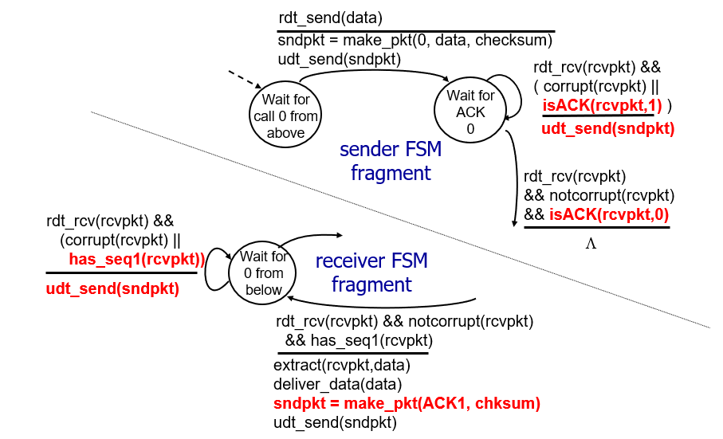

sender:

- wait for call 0 from above -> wait for ACK 0:
  - `rdt_send(data)`: 상위 레이어에서 데이터 보내달라는 요청 오면
  - `sndpkt = make_pkt(0, data, checksum) && udt_send(sndpkt)`: 0번 번호를 부여한 패킷을 만들어 네트워크 레이어로 흘려보냄

- wait for ACK 0 -> wait for call 1 above:
  - `rdt_rcv(rcvpkt) && notcorrupt(rcvpkt) && isACK(rcvpkt, 0)`: ACK0을 제대로 받으면 
  - `Λ`: 다음 1번 패킷 대기 상태로 돌아감
- wait for ACK 0 -> wait for ACK 0:
  - `rdt_rcvpkt && (corrupt(rcvpkt) || isACK(rcvpkt, 1))`: ACK가 훼손된채 도착하거나 번호가 일치하지 않는 ACK가 도착했다면
  - `udt_send(sndpkt)`: 재전송 요청

receiver:

- wait for 1 from below -> wait for 0 from below:
  - `rdt_rcv(rcvpkt) && notcorrupt(rcvpkt) && has_seq1(rcvpkt)`: 번호가 일치하는 패킷이 제대로 도착했다면
  - `extract(rcvpkt, data) && deliver_data(data) && sndpkt = make_pkt(ACK1, chksum) && udt_send(sndpkt)`: 상위 레이어에 데이터를 올려보내고, sender에게 ACK1 전달
- wait for 0 from below -> wait from 0 from below:
  - `rdt_rcv(rcvpkt) && (corrupt(rcvpkt) || has_seq1(rcvpkt))`: 받은 패킷이 훼손되었거나 번호가 일치하지 않으면
  - `udt_send(sndpkt)`: 이전 state에서 만들어 보냈던 ACK 재전송

# rdt3.0: channels with errors and loss

sender waits "reasonable" amount of time for ACK: 패킷 자체 유실 가능성이 있으므로 타이머를 설정하자

- retransmits if no ACK received in this time: 제한시간 안에 ACK가 도착하지 않으면 재전송
- if pkt (or ACK) just delayed (not lost): 만약 패킷이 유실된게 아니라 그저 지연되고 있을 뿐인 경우의 시나리오
  - retransmission will be duplicate, but seq \# already handles this!: 시간 초과해서 재전송된 중복된 패킷은 receiver가 seq \# 보고 중복된 패킷임을 확인하고 버림
  - receiver must specify \# of packet being ACKed: receiver는 ACK에 seq \# 명시해서 보내서 sender에게 몇 번 ACK까지 제대로 왔는지 알려줌
- use countdown timer to interupt after "reasonable" amount of time: 카운트다운 타이머를 작동해서 최대 대기 시간 설정, 시간 내에 일이 안끝났다면 타이머 리셋하고 다시 시작

## rdt3.0 sender

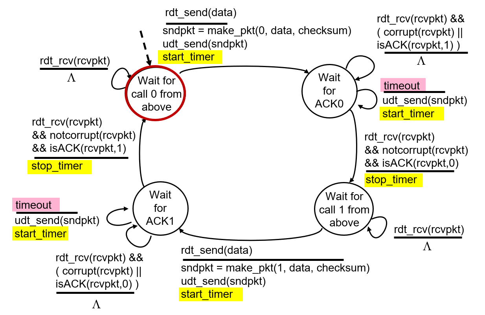

sender:

문제 없이 동작

- wait for call 0 from above -> wait for ACK0:
  - `rdt_send(data)`: 위에서 데이터 보내달라고 요청오면
  - `sndpkt = make(0, data, checksum) && udt_send(sndpkt), start_timer`: 0번 패킷 보내고 타이머 시작
- wait for ACK0 -> wait for call 1 from above:
  - `rdt_rcv(rcvpkt) && notcorrupt(rcvpkt) && isACK(rcvpkt, 0)`: 번호가 맞는 패킷이 제대로 도착하면
  - `stop_timer`: 타이머 멈추고 다음 번호 패킷 요청 대기

뭔가 문제가 있음

- wait for ACK0 -> wait for ACK0: 잘못된 번호 패킷 도착
  - `rdt_rcv(rcvpkt) && (corrupt(rvpkt) || isACK(rcvpkt, 1))`: 다른 번호 패킷이 도착하거나 훼손되면
  - `Λ`: 아무 행동 취하지 않음; 타이머가 만료되면 프로토콜에 따라 다시 보낼 것이기 때문
- wait for ACK0 -> wait for ACK0: 타이머 만료
  - `timeout`: 타이머 expired
  - `udt_send(sndpkt) && start_timer`: 재전송시키고 타이머 다시 시작

문제가 있을수도 없을수도

- wait for call 1 from above -> wait for call 1 from above
  - `rdt_rcv(rcvpkt)`: rcv에게서 패킷 받으면
  - `Λ`: 아무것도 안함; ?

## rdt3.0 in action

stop & wait protocol이기 때문이 seq \# 두개 뿐

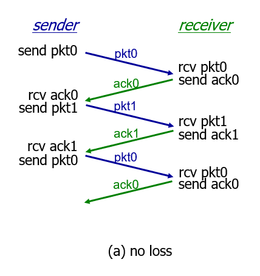

no loss: 번호에 맞는 패킷과 ack를 주고받음

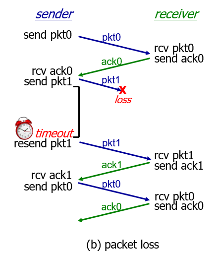

packet loss: pkt1을 보냈는데 ack1이 도착하지 않아 timeout 발생; pkt1을 재전송

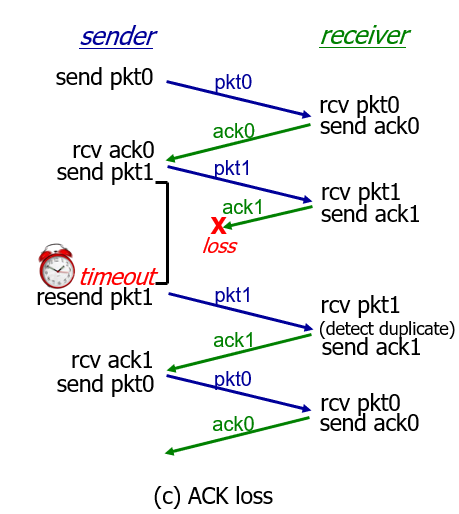

ACK loss: pkt1을 보냈는데 ack1이 도착하지 않아 timeout 발생; pkt1을 재전송 / receiver는 duplicate된 패킷을 받았기 때문에 위로 올려보지 않고 ack만 재전송

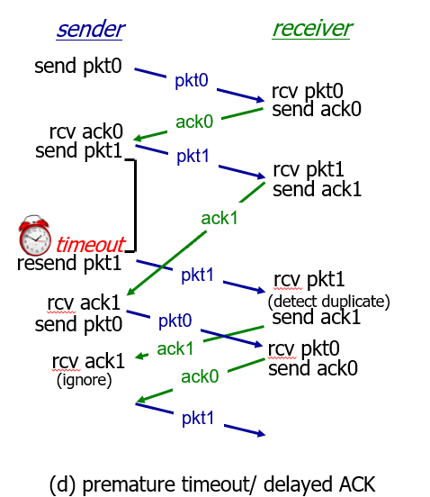

premature timeout / delayed ACK: 제대로 도착하는 중인데 timeout이 먼저 발생해버림; sender는 이미 잘 도착한 pkt1을 재전송하고 ack1을 받아 다음 패킷을 전송 / receiver는 pkt1이 중복된것이기 때문에 올려보내지 않고 ack1만 재전송 / 재전송된 ack1을 받은 sender는 ack0이 올 차례에 온 ack1을 무시해버림
