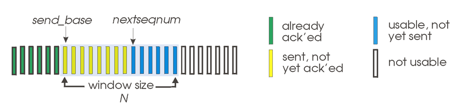
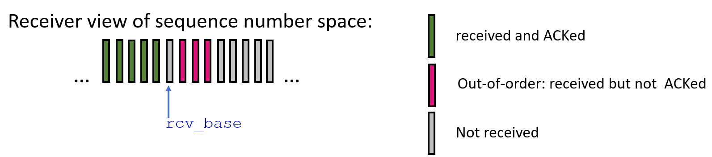
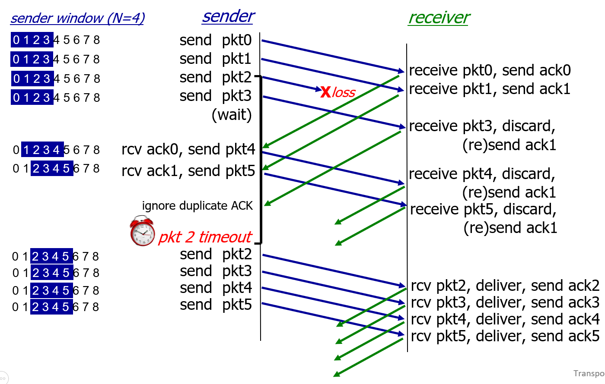
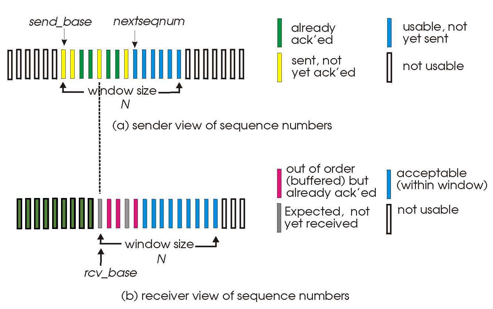
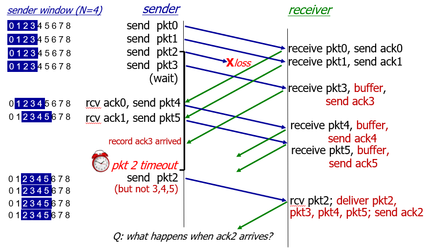

## ch3 transport layer: Principles of reliable data transfer - TCP 2

# Performance of rdt3.0 

## rdt3.0: stop-and-wait protocol

**Usender**: **utilization** - fraction of time sender busy sending 

pkt0을 보내고 pkt1을 보내기 시작할 때까지 걸리는 시간: 

- dtrans + dprop  x 2 = L / R + RTT

> 패킷을 링크에 밀어넣는 시간(transmission delay) + 왕복하는데 걸리는 시간 (propagation delay x 2 = 1 RTT)
>
> ack는 패킷에 비해 크기가 아주아주 작기 때문에 transmission delay 무시 

stop-and-wait protocol이 시간 활용은 매우 비효율적이다. ack가 도착할 때까지 아무것도 안하고 가만히 기다리기만 하니까

## rdt3.0: pipelined protocols operation

비효율적인 stop-and-wait를 버리고 파이프라인 프로토콜을 사용해보자

파이프라인 프로토콜은 n개의 패킷을 ack도착할때까지 기다리지 않고 한꺼번에 보낼 수 있다. -> 시간 효율이 stop-and-protocol에 비해 n배 높아진다; seq \# 배만큼 높아짐

그러기 위해서는 n개의 패킷을 구분하는 seq \# 필요 & receiver가 패킷 n개를 받을 buffer을 유지해야함 & sender도 재전송 가능성이 있는 패킷을 보관해두기 위한 buffer을 유지해야 함

# Go-Back-N

## Go-Back-N: sender

- sender: 크기 N짜리 window, 아직 ack를 받지 않은 상황에서 연속적으로 s개의 패킷을 보냄
- **cumulative ACK**: 누적 ack. 순서대로 도착한 패킷의 마지막 ack를 받는다
  - on receiving ACK(n): n번 ack을 받으면 send_base를 n+1로 옮긴다
- timer for oldest in-flight packet: 가장 오래된 전송중인 패킷에 대한 타이머 한 개 가동 중; 위 그림에서 가장 왼쪽 노란색 패킷에 대한 타이머
- timeout(n): retransmit packet n and all higher seq \# packets in window: n번 패킷에 대한 타임아웃 발생시, n번부터 s개만큼 재전송

## Go-Back-N: receiver

- ACK-only: always send ACK for correctly-received packet so far, with highest *in-order* seq \#; 순서대로 들어온 패킷의 가장 마지막 ack 보냄
  - may generate duplicate ACKs: 6번이 도착 안한 상태에서 7, 8번 패킷이 들어오면 계속 ack6 보냄
  - need only remember rcv_base: 위 그림에서 rcv_base에 대한 패킷이 도착하면 rcv_base(window)가 다음 회색까지 4칸 이동
- on receipt of out-of-order packet: 순서에서 벗어난 패킷을 받으면
  - can discard (don't buffer) or buffer: an implementation decision; 보통 순서에 안맞게 와도 일단 버퍼에 보관함
  - re-ACK pkt with highest in-order seq \#: 순서대로 온 패킷의 가장 높은 번호의 ack를 다시 보냄

## Go-Back-N in action

ack를 받지 않은 상황에서 4개 패킷을 한꺼번에 보낼 수 있다.

0, 1, 3 번을 받으면 ack1 반환 -> sender는 snd_base를 2번으로 옮기고 4번 패킷 전송

... ack1만 보내다가 pkt 2 timeout; snd_base의 타이머 만료됨

2번부터 4개의 패킷을 재전송

# Selective repeat

- receiver이 도착한 패킷에 대해 개별적으로 ack 전송
- sender도 전송하고 ack가 도착하기 전인 모든 패킷에 대해 개별적인 타이머 모두 가동; timeout시 timeout된 패킷 하나만 재전송
- sender window
  - N consecutive seq \#s: 한번에 s개 패킷을 보낼 수 있음
  - limits seq \#s of sent, unACKed packets: ack를 받지 않고 보낼 수 있는 최대 패킷 수는 s; Go-Back-N과 동일

## Selective repeat: sender, receiver windows

snd_base는 아직 ack를 받지 않는 plot

rcv_base는 아직 ack를 보내지 않은 plot

snd_base와 rcv_base의 sync가 맞지 않는 이유: sender가 이미 잘 도착한 패킷을 ack가 오지 않았다는 이유로 계속 보내고 있을 수 있음, receiver는 그 패킷에 대한 ack를 보냈기 때문에 이미 sliding된 상태고 중복된 패킷을 받으면 무시함

## Selective repeat: sender and receiver

ack를 받지 않은 상태에서 보낼 수 있는 pkt이 s개

sender: 

- data from above:
  - 상위 레이어에서 데이터가 내려와서 window 버퍼 공간이 남아있으면 바로 그 공간에 패킷 만들어서 넣음; 자리 없으면 상위 L는 대기타야함
- timeout(n): n에 대한 타임아웃 발생시, n번 pkt만 재전송하고 n번 타이머도 다시시작
- ACK(n) in [snd_base, snd_base + N - 1]: sender의 윈도우 범위안의 ack 받으면
  - plot n에 ack 받았다고 표시
  - n이 unACKed pkt중에 가장 작은거라면, 다음 unACKed pkt의 plot까지 window sliding

receiver:

- packet n in [rcv_base, rcv_base + N - 1]: receiver의 윈도우 범위 안의 패킷 받으면
  - send ACK(n): n번 패킷 오면 ack(n) 보냄
  - out-of-order: 순서에서 벗어난 것은 일단 버퍼에 저장
  - in-order: 순서대로 받은 부분까지 상위로 deliver & 패킷 안받은 plot까지 window sliding
- packet n in [rcv_base - N, rcv_base - 1]: 이미 sliding된 부분에 대해 패킷이 오면
  - ACK(n): 중복 전송된 거니까 ack만 보내줌; ack가 유실된 경우 이런 상황 발생
- otherwise:
  - ignore: 이상한 범위의 패킷이 오면 무시

## Selective Repeat in action

0, 1, 2, 3 pkt을 한꺼번에 보냈는데 pkt2 유실: 2번 빼고 다 ack 보내주고 순서에서 벗어난 3번은 일단 버퍼에 넣음

ack1 까지 받았으니까 snd_base가 2번에 머무름, 범위에 포함된 4, 5번 보냄 & receiver가 ack4, ack5 보내고 4 5번 pkt 버퍼에 넣음

...더이상 보낼게 없으니 wait

......pkt2 timeout! -> pkt2 '만' 재전송

receiver는 ack2를 보내고 pkt2부터 pkt5까지 deliver & rcv_base 6번으로 window sliding
