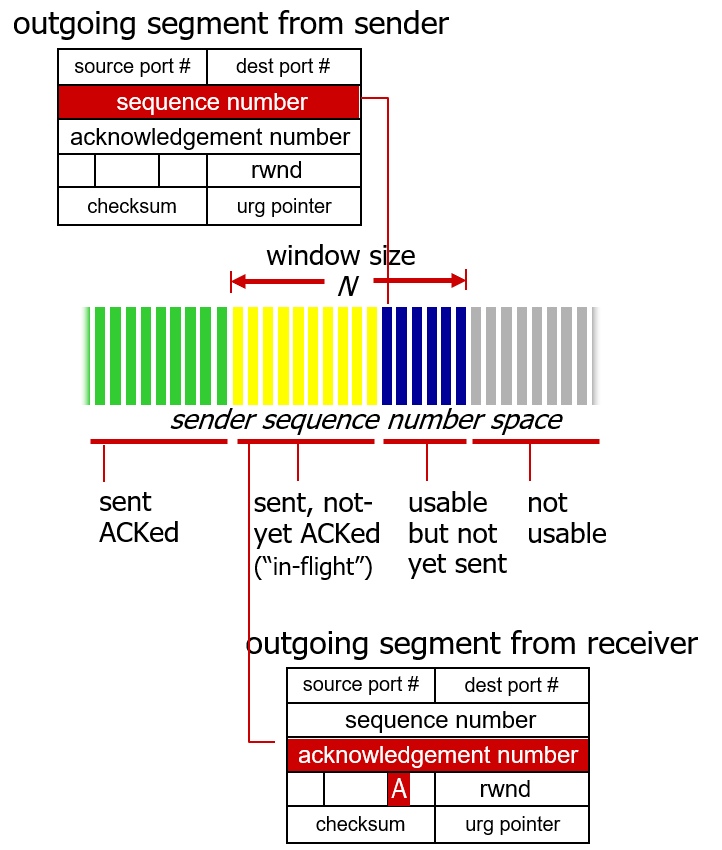

## Connection-oriented transport - TCP

# TCP: overview

- **point-to-point:** 1대 1 연결; UDP는 1대 n 가능
- reliable, in-order byte stream: receiver가 순서대로 받아들이기 때문에, sender의 TCP는 세그먼트를 마음대로 나눠서 보냄; UDP는 최대한 하나의 메세지를 하나의 세그먼트로 만듦
- full duplex data:
  - 한 커넥션 안에서 양방향으로 데이터 흘러감
  - **MSS**: 한 번에 보낼 수 있는 최대 segment size; congestion control에서 사용
- cumulative ACKs: receiver가 연속적으로 받은 데이터의 다음 번호의 ACK를 보냄
- pipelining: 동시에 다수의 패킷 보내기 가능
- connection-oriented: 양쪽의 end-system간의 연결 설정시 sender와 receiver의 상태를 초기화시킨 후 데이터 교환 가능
- flow controlled: sender는 receiver가 받아들일 수 있을 정도로 보냄; window sliding과 비슷하게 작동

# TCP segment structure

header:

- source port \#, dest port \#: 포트 번호

- sequence \#: 데이터 영역의 첫 번째 byte에 부여된 \#

- ack \#: 다음에 받을 데이터 영역의 seq \#; byte 단위

- length: 4bit

  > TCP 헤더의 크기는 가변적: 20 bytes ~ 60bytes
  >
  > - options 부분 때문에 이럼, 반면 UDP는 헤더 크기 고정
  >
  > 실제 header 크기: length field 값 (0 ~ 15) x 4 bytes

- C, E: congestion notification; 혼잡 상황을 알려줌

  - implicit congestion notification: 혼잡 발생을 추측: ack가 오는데 delay가 늘어나면 혼잡제어 모드에 들어감
  - explicit congestion notification: 라우터가 직접 거쳐간 개수를 segment에 표시: 많이 사용되진 않음

- RST, SYN, FIN: connection management

  - RST: reset 강제종료; TCP client가 오랫동안 action이 없으면 강제종료함
  - SYN: synchronize; TCP 연결 해달라고 요청
  - FIN: client가 이제 그만 연결 끊자고 함

- receive window: flow control 위해; 자신의 빈 공간 크기 (받을 수 있는 크기)

data:

- application L이 TCP 소켓을 통해 보낸 데이터
- 가변적인 데이터를 TCP sender가 마음대로 적절히 쪼개서 넣음: 순서대로 받아들일 것을 알고 있기때문에
- 데이터 영역의 첫 번째 byte에 부여되는 숫자가 seq \#: 만약 seq 100까지 제대로 받았다면, ack 101 보냄

# TCP sequence numbers, ACKs

Sequence numbers:

- 세그먼트 데이터 영역의 첫 번째 byte에 부여된 \#

Acknowledgements:

- 상대방으로부터 받을 다음 byte의 seq \#
- cumulative ACK: 0~4를 잘 받았다면 ack5 보냄

만약 receiver가 순서에서 벗어나는 패킷을 받았다면, 보통 일단 빈 공간에 받아줌; 버퍼의 크기가 작은 경우에는 버리기도 함(IOT에서 많이 그럼)

sender 측의 window:

- sender는 아직 보내지 않은 패킷을 보냄: 보내지길 대기중인 파란 plot -> 노랑
- receiver는 ACK를 보냄: ACK 대기중인 노란 plot -> 초록, window sliding

데이터가 'C'일 경우(1 byte)의 간단한 시나리오:

1. seq=42: 보내는 데이터의 번호, ACK=79: B에게서 78번까지 잘 받았으니까 그 다음꺼 보내줘
2. sep=79: 79번 보내달라니까 79번 보냄, ACK=43: A에게서 42까지 잘 받았으니까 그다음꺼 보내줘
3. seq=43: 43번 보내달라니까 43번 보냄, ACK=80: B에게서 79번까지 잘 받았으니까 그 다음꺼 보내줘