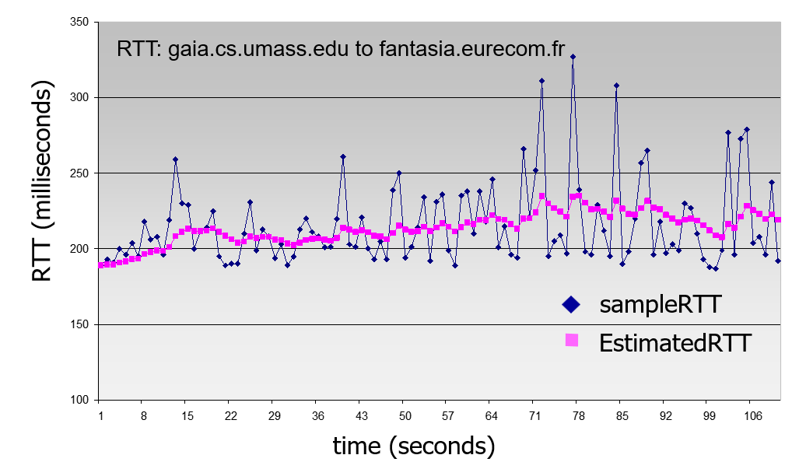
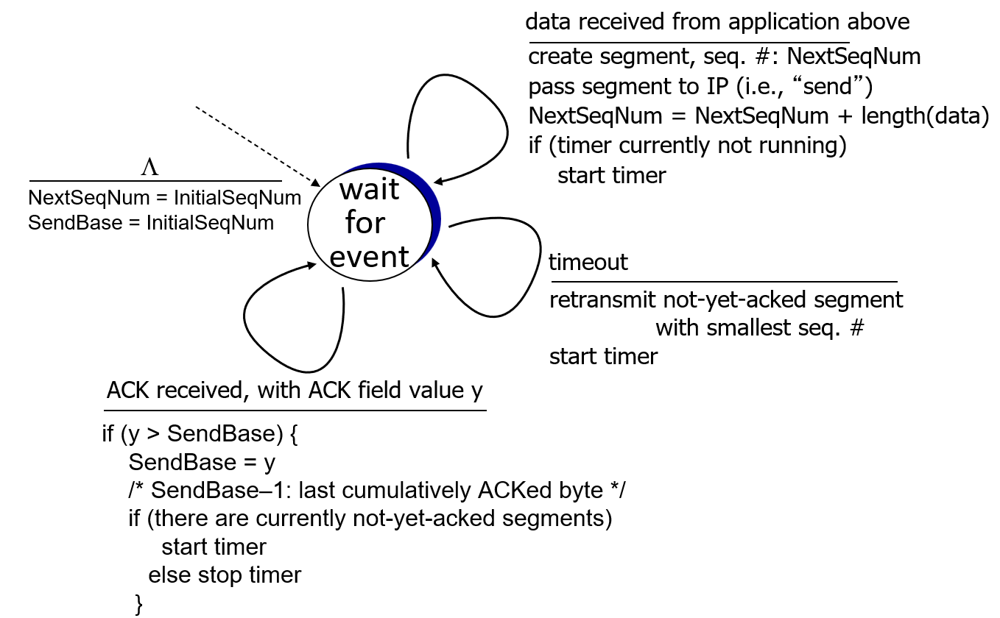

## Connection-oriented transport: TCP

# TCP round trip time, timeout


Q: TCP timeout을 어느정도로 설정해야 할까?

- 적어도 1 RTT보다는 커야한다: 적어도 ack가 도착할 때까지는 대기타야한다
- 반면 너무 길게 설정하면 반응시간 너무 늦어져서 성능에 문제

Q: 그러면 RTT는 어떻게 측정할까? 

(당연하지만 sender가 측정)

## SampleRTT

- `SampleRTT`: seg 전송 ~ ack 받을 때 까지의 시간
  - 재전송은 무시: sender가 seg \#x를 2번 보내고 ack \#x를 받았다면, 둘 중 어느 seg에 대한 ack \#x인지 구분 못함 (커튼 쳐저 있는 상태)
- `SampleRTT`는 변동이 심하므로, RTT의 변동을 스무스하게 하기 위해서는 최근 값들 까지 반영해야함 -> `EstimatedRTT`

## EstimatedRTT

```
EstimatedRTT = (1 - ɑ) * EstimatedRTT + ɑ * SampleRTT
```



- <u>e</u>xponential <u>w</u>eighted <u>m</u>oving <u>a</u>verage (EWMA): 기존 값에 최근 측정 값을 일정 비율로 반영; 새롭게 측정될 때마다 바뀜
  - sample값이 급격히 변화해도 estimated값은 크게 변하지 않는다; 최근의 급격한 변동을 크게 반영하지 않음
  - 과거의 SampleRTT의 영향은 급격히 줄어든다
- 보통 `ɑ = 0.125`로 설정함; 새로 측정된 부분은 12.5% 반영 (실험적 결과)

## TimeoutInterval

- `EstimatedRTT` + "safety margin": 결과적으로 타임아웃은 `EstimatedRTT`에 적당한 마진을 더해서 설정한다.

```
TimeoutInterval = EstimatedRTT + 4 * DevRTT
```

>  Dev: deviation; 편차
>
> `EstimatedRTT`의 변동이 클 수록(편차가 클수록) 마진을 크게 둔다.
>
> 4 * 는 실험적 결과

## DevRTT

- `SampleRTT`와 `EstimatedRTT`의 편차의 EWMA

```
DevRTT = (1 - B) * DevRTT + B * |SampleRTT - EstimatedRTT|
```

> 기존 편차: `DevRTT`
>
> 최근 측정된 편차: `|SampleRTT - EstimatedRTT|`
>
> 보통 `B = 0.25`; 실험적  결과


# TCP Sender (simplified)



event: data received from application

- seq \#을 포함한 segment 생성; seg \#는 seg의 데이터 영역의 첫 번째 바이트에 부여된 번호
- 타이머가 안돌아가고 있으면 타이머 작동시킨다
  - 가장 오래된 unacked seg에 대해; snd_base
  - 타이머는 `TimeoutInterva`에서부터 카운트다운

event: timeout

- (ack 안받은 가장 오래된 seg) 재전송 & 타이머 다시 시작

event: ACK received

- 